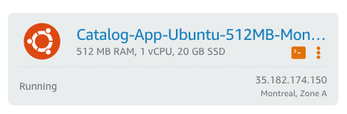
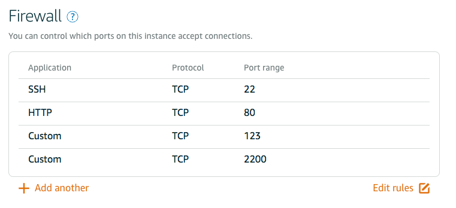

# wsgi_catalog
A wsgi enabled web application, deployed to [_**Amazon Lightsail**_](https://lightsail.aws.amazon.com), that will display items for a defined set of categories.  The application will also allow CRUD actions for those users who sign in via Google OATH2. (Note: this project will require https to be enabled in order to use Facebook OATH2.)

The source for this project is located [here](https://github.com/rr2674/item_catalog).
## Host/Site Details
- IP address: 35.182.174.150
- URL: http://35.182.174.150.xip.io/

## VM Details
- Linux Distribution Description:	Ubuntu 16.04.6 LTS
- Managed by user `grader` via port 2200, RSA key only:
  - `ssh grader@35.182.174.150 -p 2200 -i <YOUR PATH HERE>/.ssh/grader`
- User `grader` has been granted `sudo` access
- `NTP` port 123 is also open

#### Firewall Setup:
- Server side:
  - `sudo ufw default deny incoming`
  - `sudo ufw default allow outgoing`
  - `sudo ufw allow 2200/tcp`
  - `sudo ufw allow www`
  - `sudo ufw enable`
- Provider side:
  - From the _**Amazon Lightsail**_ portal, select the Instance 'Manage' option (inline dot's right side of instance image)
  
  - From the instance menu, choose 'Networking' to reveal firewall configuration.  Add Custom options as seen below:
  
#### User grader Setup:
As Ubuntu user (via Lightsail terminal access to instance)
- Create keys via:
  - `ssh-keygen`
- Create `grader` user:
  - `sudo adduser grader`
- Create .ssh directory and store public key for `grader`:
  - `sudo mkdir /home/grader/.ssh`
  - `sudo chown -R grader:grader /home/grader/.ssh`
  - `sudo cp .ssh/udacity_student.pub /home/grader/.ssh/authorized_keys`
  - `sudo chmod 700 /home/grader/.ssh`
  - `sudo chmod 644 /home/grader/.ssh/authorized_keys`


#### Software Packages Installed:
- `sudo apt-get install apache2`
- `sudo apt-get install libapache2-mod-wsgi`
- `sudo apt-get install virtualenv`
- `sudo apt-get install postgresql`
- `sudo apt-get install python-pip`
#### Software Package Configurations:
- postgres server setup:
 - `sudo su - postgres`
 - `createuser -dRSP catalog`
 - `createdb catalog`
- apache2 setup:
 - Make a directory for the application:
   - `sudo mkdir /var/www/flask-prod`
 - Change to that directory:
   - `cd /var/www/flask-prod`
 - Create catalog.wsgi file:
   - `sudo vi catalog.wsgi`
 - And then populate the file with:   
   ```
   import sys

   sys.path.append('/var/www/flask-prod/item_catalog')

   from flask_server import app as application

   application.secret_key = "'\x7f\x90TW3#\xe8X\xcc\xd9VNb\xba\x91"
   ```
 - Clone the project to this directory:
   - `sudo git clone https://github.com/rr2674/item_catalog.git`
 - Create venv for mod-wsgi and install python dependencies:
   - `cd item_catalog/`
   - `sudo virtualenv -p python venv`
   - `sudo chown -R grader:grader venv/`
   - `source venv/bin/activate`
   - `pip install flask packaging oauth2client flask-httpauth flask-sqlalchemy psycopg2-binary requests`
   - `pip install sqlalchemy`
   - `pip install passlib`
   - `pip install --upgrade google-auth`
   - `deactivate`
 - Create postgres tables:
   - `python database_setup.py`   
 - Add site configuration to apache2 via:
   - `sudo vi /etc/apache2/sites-available/000-default.conf`
 - Add the following before the ending tag `</VirtualHost>`
 ```        
 WSGIDaemonProcess catalog python-path=/var/www/flask-prod:/var/www/flask-prod/item_catalog/venv/lib/python2.7/site-packages
        WSGIProcessGroup catalog
        WSGIScriptAlias / /var/www/flask-prod/catalog.wsgi
 ```
 - Restart apache2
   - `sudo service apache2 restart`
